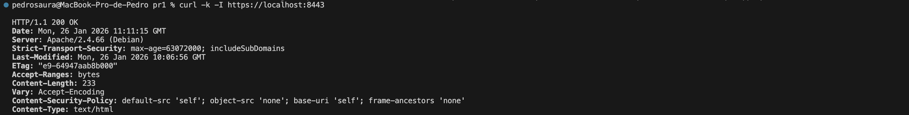
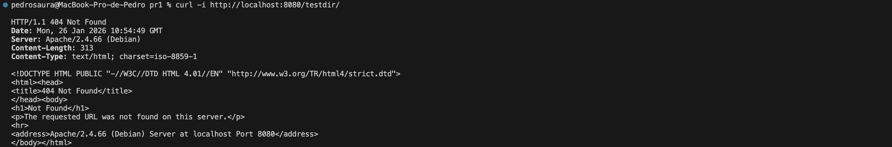
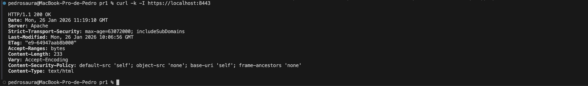

# PR1 – Apache Server Hardening (SSL, HSTS, CSP)

## Objetivo
El objetivo de esta práctica es aplicar medidas básicas de **hardening** sobre un servidor web Apache desplegado en un contenedor Docker, siguiendo el apartado **3.1.1 – Server Hardening** del módulo *Puesta en Producción Segura*.

En concreto, se pretende:

- Reducir la superficie de ataque del servidor.
- Evitar la exposición de información sensible.
- Forzar el uso de comunicaciones seguras mediante HTTPS.
- Aplicar cabeceras de seguridad recomendadas.

---

## Implementación
Se ha desplegado un servidor **Apache 2** sobre una imagen base `debian:12-slim`, configurado y ejecutado dentro de un contenedor Docker.

Las principales medidas de hardening aplicadas han sido:

- Instalación y configuración de Apache en un entorno aislado mediante Docker.
- Deshabilitación del módulo `autoindex` para evitar el listado de directorios.
- Habilitación del módulo `ssl` y generación de un certificado **autofirmado** para pruebas.
- Configuración de un VirtualHost HTTPS.
- Aplicación de cabeceras de seguridad:
  - **Strict-Transport-Security (HSTS)** para forzar el uso de HTTPS.
  - **Content-Security-Policy (CSP)** con una política restrictiva adecuada para un sitio estático.
- Reducción de la información expuesta por el servidor mediante:
  - `ServerTokens Prod`
  - `ServerSignature Off`

En sistemas basados en Debian, Apache incluye por defecto un archivo `security.conf` que expone información del servidor. Para asegurar que las directivas de hardening prevalecen, se ha creado un archivo de configuración propio con prioridad de carga superior (`z-security-hardening.conf`).

---

## Build
Desde el directorio `pr1`:

docker build -t pps/pr1 .

---

## Run

Ejecución del contenedor exponiendo los puertos HTTP y HTTPS:

  docker run --rm -d -p 8080:80 -p 8443:443 --name pps-pr1 pps/pr1

---

## Validación
1. Comprobación de HTTPS y cabeceras de seguridad
Se verifica que el servidor responde correctamente por HTTPS y que las cabeceras de seguridad están presentes:

  curl -k -I https://localhost:8443

Se comprueba la presencia de:
· Strict-Transport-Security
· Content-Security-Policy
· Cabecera Server con información de versión y sistema operativo

2. Comprobación de autoindex deshabilitado
Se accede a un directorio sin fichero index y se verifica que no se muestra el listado de archivos:

  curl -i http://localhost:8080/testdir/

El servidor devuelve un error 404 Not Found, confirmando que el módulo autoindex está deshabilitado correctamente.

3. Comprobación de ocultación de información del servidor
Se verifica que:
· No se expone la versión exacta de Apache en la cabecera Server
· Las páginas de error no muestran información sensible sobre el servidor ni el sistema operativo

## Evidencias
Las capturas de pantalla y salidas de los comandos de validación se encuentran en la carpeta:

  pr1/img/

Entre ellas:
· Cabeceras HTTPS con HSTS y CSP
· Acceso a directorio sin listado de archivos
· Página de error sin información de versión
· Contenedor Docker en ejecución
Estado del contenedor en ejecución:

## Referencias
· Hardening del servidor web Apache – Puesta en Producción Segura
https://psegarrac.github.io/Ciberseguridad-PePS/tema3/seguridad/web/2021/03/01/Hardening-Servidor.html
· Práctica SSL en Apache
https://psegarrac.github.io/Ciberseguridad-PePS/tema1/practicas/2020/11/08/P1-SSL.html