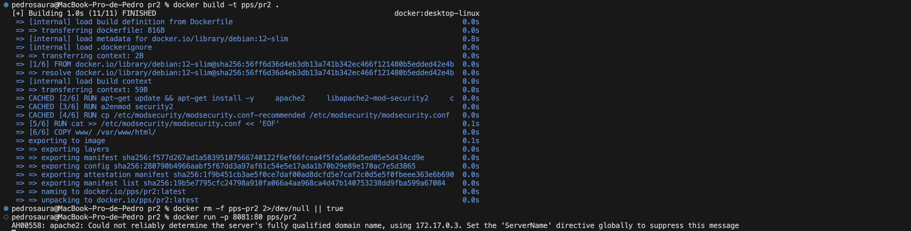
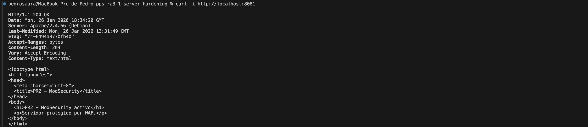

# PR2 – Protección del servidor web con ModSecurity (WAF)

## Objetivo
El objetivo de esta práctica es desplegar un servidor web Apache protegido mediante **ModSecurity** actuando como **Web Application Firewall (WAF)**, configurado en modo bloqueo y con una regla personalizada para detectar y mitigar ataques de tipo **SQL Injection**.

---

## Resumen
Se ha configurado un contenedor Docker con Apache y ModSecurity activado.  
Se ha definido una regla personalizada que analiza los parámetros de las peticiones HTTP en busca de patrones típicos de inyección SQL.  
El correcto funcionamiento del WAF se ha validado mediante peticiones legítimas y maliciosas, comprobando que estas últimas son bloqueadas con código HTTP **403 Forbidden**.

---

## Build
Desde el directorio `pr2` se construye la imagen Docker:

        docker build -t pps/pr2 .

---

## Run
Ejecución del contenedor exponiendo el servicio HTTP:

        docker run -p 8081:80 pps/pr2

---

## Validación
1. Petición legítima
Se realiza una petición HTTP normal para comprobar que el servidor responde correctamente:

        curl -i http://localhost:8081

Resultado esperado:
- Código de respuesta 200 OK
- Contenido HTML de la página web

2. Ataque de inyección SQL
Se simula un ataque SQL Injection mediante parámetros maliciosos en la URL:

        curl -i "http://localhost:8081/?id=1%20OR%201=1"

Resultado esperado:
- Código de respuesta 403 Forbidden
- Petición bloqueada por ModSecurity

Esto confirma que el WAF detecta y bloquea correctamente el ataque.

---

## Evidencias
Las evidencias de la práctica se encuentran en la carpeta:

        pr2/img/

Incluyen:
- Petición HTTP legítima (200 OK)
- Petición con ataque SQL Injection bloqueada (403 Forbidden)
- Contenedor Docker en ejecución

---

## Referencias
- Hardening del servidor web Apache – Puesta en Producción Segura
https://psegarrac.github.io/Ciberseguridad-PePS/tema3/seguridad/web/2021/03/01/Hardening-Servidor.html
