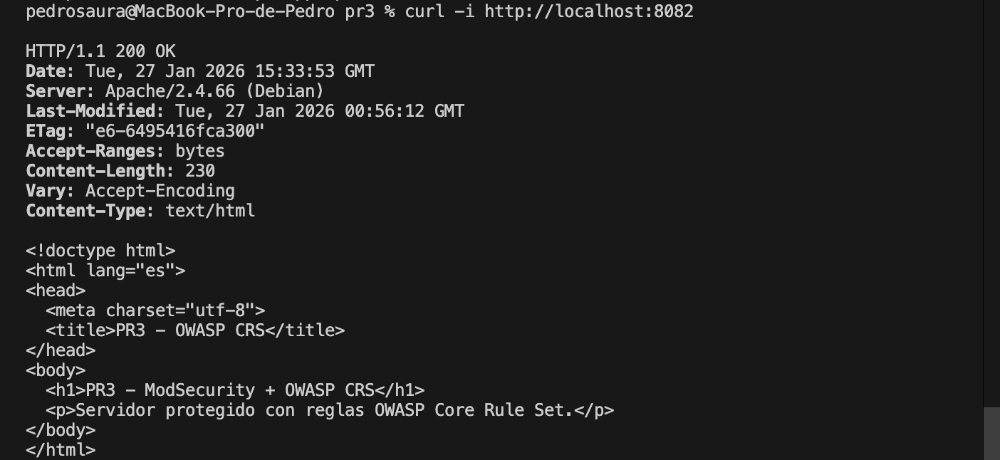
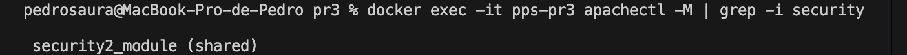
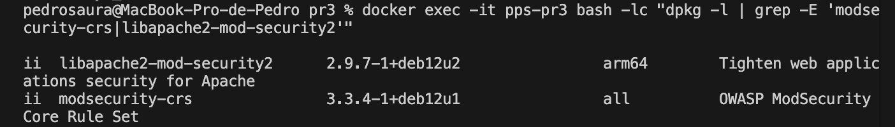

# PR3 – OWASP Core Rule Set (CRS) en Apache (ModSecurity)

## Objetivo
Instalar y desplegar un servidor Apache en Docker con **ModSecurity** y el conjunto de reglas **OWASP Core Rule Set (CRS)** utilizando los paquetes oficiales de Debian, verificando:
- Servicio web operativo.
- Módulo `security2` cargado.
- Paquetes `libapache2-mod-security2` y `modsecurity-crs` instalados.

---

## Resumen
Se ha creado una imagen Docker basada en `debian:12-slim` con Apache y ModSecurity.  
Para OWASP CRS se utiliza el paquete del sistema (`modsecurity-crs`) en lugar de clonar repositorios externos, obteniendo una instalación estable y reproducible.

---

## Build
Desde el directorio `pr3`:

    docker build -t pps/pr3 .

---

## Run

    docker rm -f pps-pr3 2>/dev/null || true
    docker run -d -p 8082:80 --name pps-pr3 pps/pr3

---

## Validación
1) Comprobación del servicio web (HTTP 200)

    curl -i http://localhost:8082

Resultado esperado: HTTP/1.1 200 OK.

2) Verificar que ModSecurity está cargado en Apache

    docker exec -it pps-pr3 apachectl -M | grep -i security

Resultado esperado: aparece security2_module (shared).

3) Verificar instalación de paquetes (CRS + ModSecurity)

    docker exec -it pps-pr3 bash -lc "dpkg -l | grep -E 'modsecurity-crs|libapache2-mod-security2'"

---

## Evidencias
Las evidencias (capturas/salidas) se guardan en:

    pr3/img/

Incluyen:
Comprobación del servicio web (HTTP 200)
Verificación de que ModSecurity está cargado en Apache
Verificación instalación de paquetes (CRS + ModSecurity)

---

## Referencias
    · Hardening del servidor web (Apache / ModSecurity / OWASP) – Puesta en Producción Segura
    https://psegarrac.github.io/Ciberseguridad-PePS/tema3/seguridad/web/2021/03/01/Hardening-Servidor.html
    · Guías complementarias (Hardening)
    https://geekflare.com/cybersecurity/apache-web-server-hardening-security/