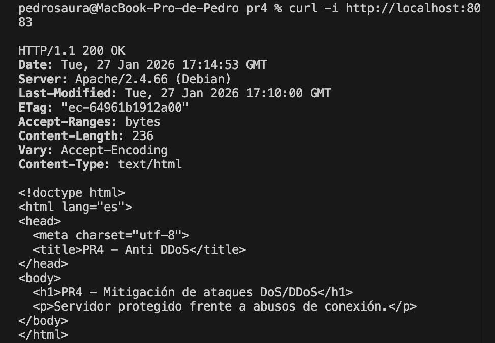
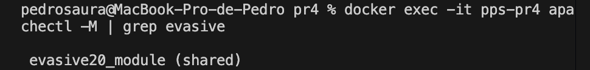
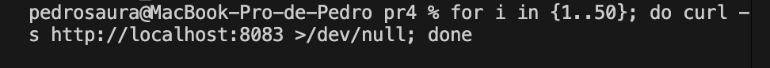

# PR4 – Mitigación de ataques DoS/DDoS en Apache

## Objetivo
Aplicar medidas básicas de mitigación frente a ataques de denegación de servicio
(**DoS/DDoS**) sobre un servidor web Apache, siguiendo el apartado 3.1.1 de
*Server Hardening* del módulo Puesta en Producción Segura.

---

## Enfoque
Dado que se trata de un entorno de laboratorio, se implementan mecanismos
defensivos orientados a mitigar ataques de baja intensidad y abusos de conexión,
utilizando módulos nativos de Apache.

La protección se basa en:
- Limitación de peticiones excesivas
- Detección de floods HTTP
- Prevención de ataques tipo Slowloris

---

## Medidas aplicadas

### mod_evasive
Se utiliza el módulo **mod_evasive** para detectar y bloquear clientes que realizan
un número excesivo de peticiones en un intervalo de tiempo reducido.

Parámetros destacados:
- `DOSPageCount`
- `DOSSiteCount`
- `DOSBlockingPeriod`

### mod_reqtimeout
Se activa **mod_reqtimeout** para limitar el tiempo máximo de recepción de cabeceras
y cuerpo de las peticiones, mitigando ataques de tipo Slow HTTP.

---

## Despliegue

### Build

    docker build -t pps/pr4 .

---

## Run

    docker run -d -p 8083:80 --name pps-pr4 pps/pr4

## Validación
1. Comprobación del servicio:

    curl -i http://localhost:8083

Resultado esperado: 200 OK

2. Verificación del módulo evasive:
    
    apachectl -M | grep evasive

3. Simulación básica de múltiples peticiones:

    for i in {1..50}; do curl -s http://localhost:8083 >/dev/null; done

---

## Limitaciones
Las medidas implementadas están orientadas a ataques de baja intensidad en entornos
controlados. Para mitigación de DDoS a gran escala serían necesarias soluciones
externas como firewalls dedicados, balanceadores o CDNs.

---

## Referencias
    · Apache mod_evasive
    · OWASP – Denial of Service
    · Puesta en Producción Segura – Server Hardening
