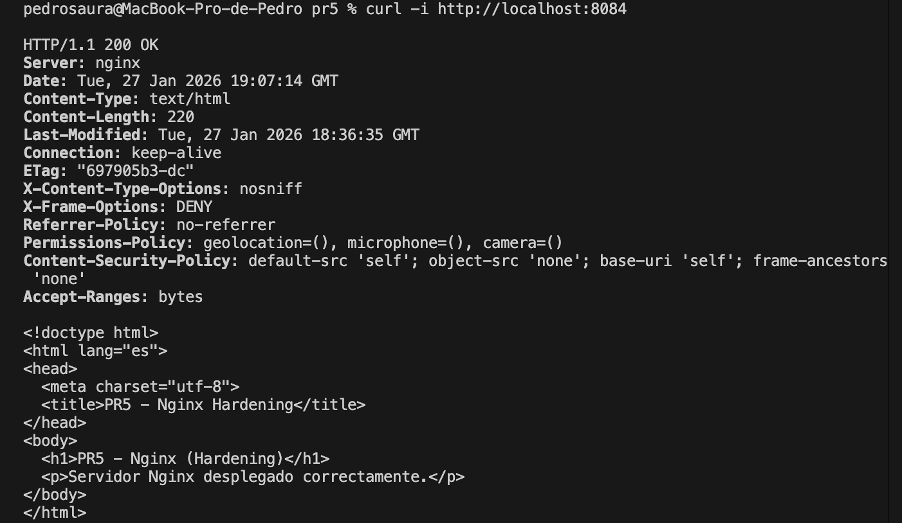
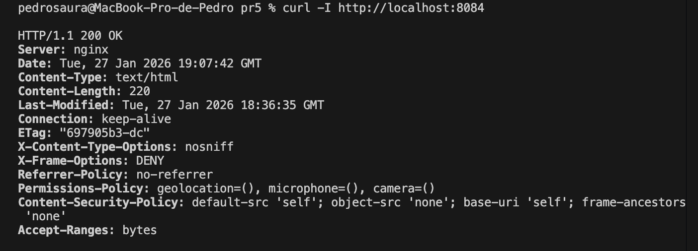
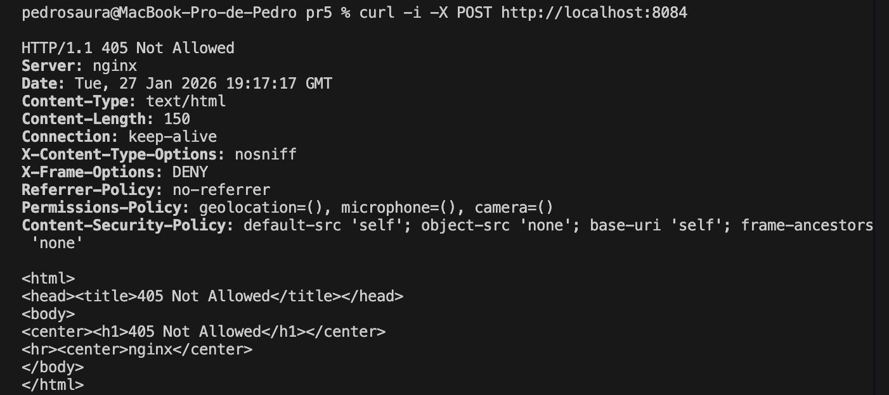
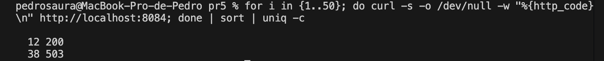

# PR5 – Nginx Hardening (EXTRA)

## Objetivo
Implementar un servidor web Nginx aplicando medidas adicionales de hardening y mitigación de abusos, como práctica extra del módulo.

---

## Implementación
- Servidor Nginx desplegado en contenedor Docker.
- Aplicación de cabeceras de seguridad OWASP.
- Restricción de métodos HTTP no utilizados.
- Rate limiting para mitigar ataques DoS/DDoS.
- Ocultación de información sensible del servidor.

---

## Build

    docker build -t pps/pr5 .

---

## Run
docker run -d -p 8084:80 --name pps-pr5 pps/pr5

---

## Validación
1. Acceso HTTP

    curl -i http://localhost:8084

2. Cabeceras de seguridad

    curl -I http://localhost:8084

3. Métodos no permitidos

    curl -i -X POST http://localhost:8084

4. Mitigación DoS

    for i in {1..50}; do curl -s -o /dev/null -w "%{http_code}\n" http://localhost:8084; done | sort | uniq -c

## Nota sobre HTTPS
El uso de HTTPS y HSTS ya ha sido implementado y validado en la Práctica 1 (Apache Server Hardening), por lo que esta práctica extra se centra exclusivamente en mecanismos adicionales de hardening y mitigación de abusos en Nginx.

---

## Referencias

- Nginx Security Controls
https://docs.nginx.com/nginx/admin-guide/security-controls/

- OWASP Secure Headers Project
https://owasp.org/www-project-secure-headers/

- OWASP Top 10 – Web Application Security Risks
https://owasp.org/www-project-top-ten/

- Hardening del servidor web – Puesta en Producción Segura
https://psegarrac.github.io/Ciberseguridad-PePS/tema3/seguridad/web/2021/03/01/Hardening-Servidor.html

- Nginx Rate Limiting
https://nginx.org/en/docs/http/ngx_http_limit_req_module.html
