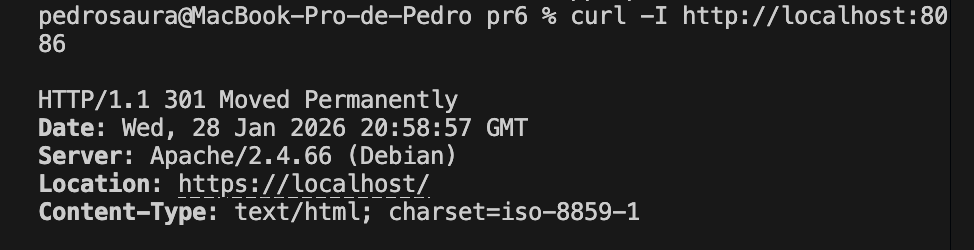
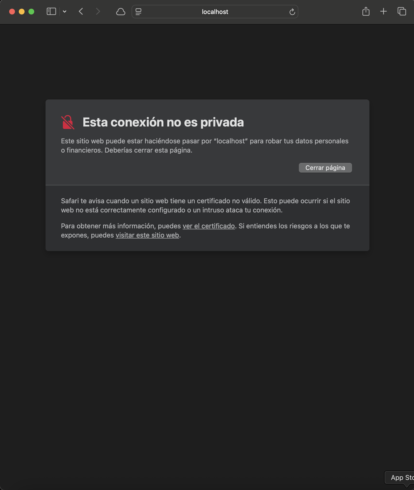
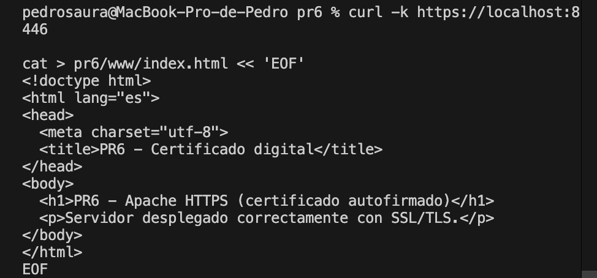
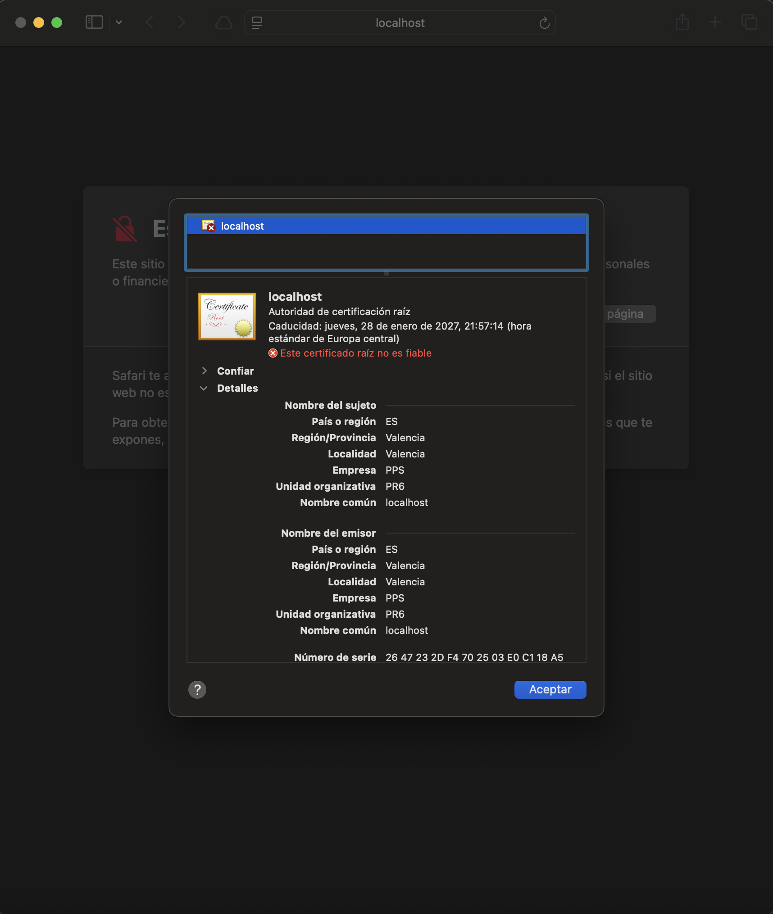

# PR6 – Certificados digitales (Apache + SSL)

## Objetivo
El objetivo de esta práctica es **implementar y comprender el uso de certificados digitales SSL/TLS** en un servidor web Apache, siguiendo el procedimiento descrito en el apartado correspondiente del módulo *Puesta en Producción Segura*.

En concreto, se persigue:

- Activar SSL en Apache.
- Generar un certificado digital **autofirmado**.
- Configurar un VirtualHost HTTPS.
- Redirigir automáticamente el tráfico HTTP a HTTPS.
- Verificar el funcionamiento de HTTPS y el cifrado de las comunicaciones.
- Comprender la diferencia entre certificados autofirmados y certificados emitidos por una Autoridad de Certificación (CA).

---

## Despliegue del servidor

El servidor se despliega dentro de un contenedor Docker basado en `debian:12-slim`, instalando Apache y OpenSSL.

Durante el proceso de construcción de la imagen se realiza:

- Activación del módulo `ssl`.
- Generación de un certificado SSL autofirmado mediante OpenSSL.
- Configuración del VirtualHost HTTPS.
- Configuración de redirección HTTP → HTTPS.

---

## Generación del certificado autofirmado

El certificado se genera automáticamente durante el *build* del contenedor mediante el siguiente comando:

    openssl req -x509 -nodes -days 365 \
    -newkey rsa:2048 \
    -keyout /etc/apache2/ssl/server.key \
    -out /etc/apache2/ssl/server.crt \
    -subj "/C=ES/ST=Valencia/L=Valencia/O=PPS/OU=PR6/CN=localhost"

---

## Configuración HTTPS

## VirtualHost SSL (Puerto 443)
El servidor HTTPS se configura en el fichero default-ssl.conf:
- Activación de SSLEngine.
- Definición del certificado y la clave privada.
- Documento raíz en /var/www/html.

## Redirección HTTP → HTTPS
El tráfico HTTP entrante se redirige automáticamente a HTTPS mediante un VirtualHost en el puerto 80:

    <VirtualHost *:80>
        ServerName localhost
        Redirect permanent / https://localhost/
    </VirtualHost>

Esto garantiza que todas las comunicaciones se realicen de forma cifrada.

---

## Build
Desde el directorio pr6:

        docker build -t pps/pr6 .

---

## Run
Ejecución exponiendo HTTP y HTTPS:

        docker run -d -p 8086:80 -p 8446:443 --name pps-pr6 pps/pr6

---

## Validación

1. Redirección HTTP → HTTPS
Se comprueba que el acceso por HTTP redirige automáticamente a HTTPS:

        curl -I http://localhost:8086

Resultado esperado:
- Código 301 / 308
- Cabecera Location apuntando a HTTPS

2. Acceso HTTPS con certificado autofirmado
Al acceder desde el navegador a:

        https://localhost:8446

El navegador muestra un aviso de seguridad indicando que el certificado no es confiable, lo cual es comportamiento esperado al tratarse de un certificado autofirmado.

3. Comprobación HTTPS con curl
Se valida el acceso HTTPS ignorando la verificación del certificado:

        curl -k https://localhost:8446

Resultado esperado:
- Código 200 OK
- Contenido HTML servido correctamente

4. Inspección del certificado
Desde el navegador se revisan los detalles del certificado:
- Emisor: Autofirmado.
- Common Name: localhost.
- Periodo de validez correcto.

---

## Diferencia entre certificado autofirmado y CA real
- Certificado autofirmado:
    - No está firmado por una entidad de confianza.
    - Genera advertencias en el navegador.
    - Útil para entornos de pruebas y aprendizaje.
- Certificado emitido por una CA:
    - Firmado por una Autoridad de Certificación reconocida.
    - No genera advertencias.
    - Ejemplo: Let’s Encrypt, DigiCert, GlobalSign.
En esta práctica no se requiere la implementación de certificados emitidos por una CA real.

---

## Evidencias
Las capturas de validación se encuentran en:

    pr6/img/

Incluyen:
- Redirección HTTP → HTTPS
- Aviso de certificado no confiable
- Acceso HTTPS correcto
- Detalles del certificado digital

---

## Referencias
- Certificado digital – Puesta en Producción Segura
https://psegarrac.github.io/Ciberseguridad-PePS/tema1/practicas/2020/11/08/P1-SSL.html
- Apache SSL/TLS Documentation
https://httpd.apache.org/docs/2.4/ssl/
- OpenSSL Documentation
https://www.openssl.org/docs/
