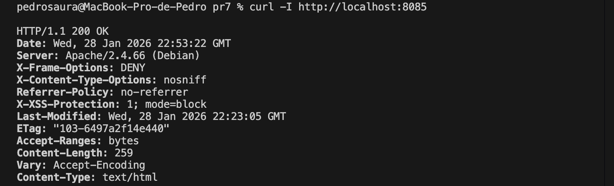
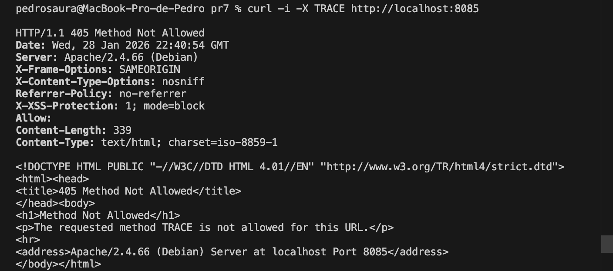
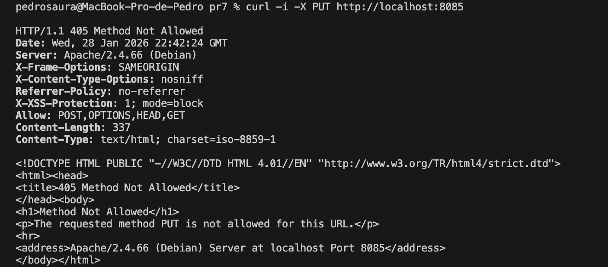
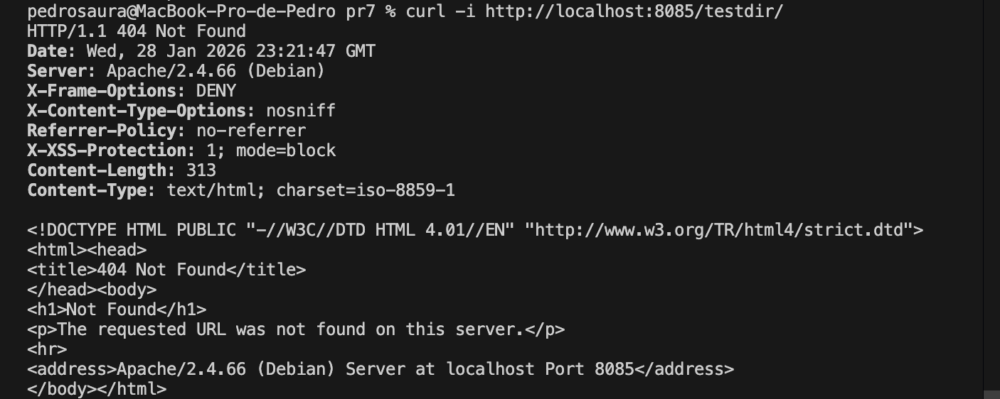

## PR7 – Apache Hardening Best Practices

## Objetivo
El objetivo de esta práctica es aplicar **buenas prácticas de hardening en Apache** siguiendo las recomendaciones del documento Apache Web Server Hardening and Security Guide.

Se busca:

- Reducir la superficie de ataque del servidor web.
- Evitar la exposición de información sensible.
- Restringir métodos HTTP peligrosos.
- Aplicar cabeceras de seguridad estándar.
- Prevenir ataques comunes como clickjacking o enumeración de recursos.

---

## Implementación
Se ha desplegado un servidor **Apache 2** sobre una imagen debian:12-slim, configurado dentro de un contenedor Docker.

Las medidas aplicadas han sido:

- **Ocultación de información del servidor**
    - ServerTokens Prod
    - ServerSignature Off
- **Desactivación de métodos HTTP inseguros**
    - Bloqueo explícito de métodos como TRACE y PUT.
- **Deshabilitación del listado de directorios**
    - Options -Indexes
- **Cabeceras de seguridad**
    - X-Frame-Options: DENY
    - X-Content-Type-Options: nosniff
    - Referrer-Policy: no-referrer
    - X-XSS-Protection: 1; mode=block

Estas directivas se han centralizado en un archivo de configuración de hardening cargado por Apache con prioridad adecuada.

---

## Build
Desde el directorio pr7:

        docker build -t pps/pr7 .

---

## Run
Ejecución del contenedor exponiendo el servicio HTTP:

        docker run -d -p 8085:80 --name pps-pr7 pps/pr7

---

## Validación
1. Comprobación de cabeceras de seguridad

        curl -I http://localhost:8085

Resultado esperado:
- No se muestra la versión de Apache.
- Presencia de cabeceras de seguridad configuradas.

2. Bloqueo de métodos HTTP inseguros

        curl -i -X TRACE http://localhost:8085
        curl -i -X PUT http://localhost:8085

Resultado esperado:
- Respuesta 405 Method Not Allowed.

3. Desactivación de autoindex
Se accede a un directorio sin fichero index:

        curl -i http://localhost:8085/testdir/

Resultado esperado:
- Respuesta 404 Not Found.
- No se muestra listado de archivos.

---

## Evidencias
Las evidencias de la práctica se encuentran en la carpeta:

        pr7/img/

Incluyen:
- Cabeceras HTTP de seguridad
- Bloqueo de métodos inseguros
- Acceso denegado a directorios sin index
- Contenedor Docker en ejecución

---

## Conclusión
La aplicación de estas medidas permite endurecer significativamente la configuración por defecto de Apache, reduciendo la exposición de información sensible y mitigando vectores de ataque comunes.
Estas prácticas son complementarias a otras técnicas de seguridad como el uso de HTTPS, WAFs o limitación de peticiones.

---

## Referencias
- Apache Web Server Hardening and Security Guide
(Documento proporcionado en el módulo Puesta en Producción Segura)
- Apache HTTP Server Documentation – Security Tips
https://httpd.apache.org/docs/2.4/misc/security_tips.html
